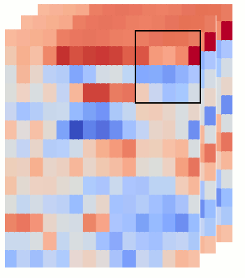

# Speaker Recognition (3D CNN) 

Keras implimentation of "Deep Learning &amp; 3D Convolutional Neural Networks for Speaker Verification"

### Prerequisites

+ tensorflow / tensorflow-gpu
+ pytorch
+ scipy
+ numpy

This code is aimed to provide the implementation for Speaker Verification (SR) by using 3D convolutional neural networks following the SR protocol.

### Code Implementation

The input pipeline is implimented in  ``./dataset.py`` for a more detailed description...

#### Input Pipeline for this work

The MFCC features can be used as the data representation of the spoken utterances at the frame level. However, a
drawback is their non-local characteristics due to the last DCT 1 operation for generating MFCCs. This operation disturbs the locality property and is in contrast with the local characteristics of the convolutional operations. The employed approach in this work is to use the log-energies, which we
call MFECs. The extraction of MFECs is similar to MFCCs
by discarding the DCT operation. The temporal features are
overlapping 20ms windows with the stride of 10ms, which are
used for the generation of spectrum features. From a 0.8-
second sound sample, 80 temporal feature sets (each forms
a 40 MFEC features) can be obtained which form the input
speech feature map. Each input feature map has the dimen-
sionality of ζ × 80 × 40 which is formed from 80 input
frames and their corresponding spectral features, where ζ is
the number of utterances used in modeling the speaker during
the development and enrollment stages.

---------
Citation
---------

If you used this code please kindly cite the following paper:

.. code:: shell

  @article{torfi2017text,
    title={Text-Independent Speaker Verification Using 3D Convolutional Neural Networks},
    author={Torfi, Amirsina and Nasrabadi, Nasser M and Dawson, Jeremy},
    journal={arXiv preprint arXiv:1705.09422},
    year={2017}
  }

The **speech features** have been extracted using [SpeechPy]_ package.

## Authors

* **Imran Paruk** - *Keras conversion* - [imranparuk](https://github.com/imranparuk/)
* **Amirsina Torfi** - *Initial work + paper* - [astorfi](https://github.com/astorfi)

See also the list of [contributors](https://github.com/imranparuk/speaker-recognition-3d-cnn/contributors) who participated in this project.

## License

This project is licensed under the MIT License - see the [LICENSE.md](LICENSE.md) file for details

## Acknowledgments

* Thanks for the work done by Amirsina Torfi [astorfi](https://github.com/astorfi) for his project and paper for which this project is based off.

